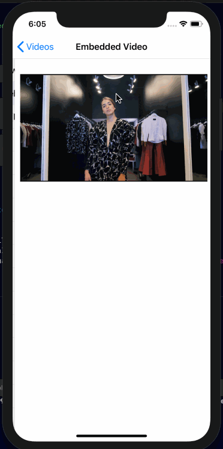

# Video Player
### Working with AVFoundation & AVKit to explore some ways of playing videos. Project is meant to supplement my understanding of how videos work to integrate this feature in bigger project that needs to incorporate remote videos on a UICollectionView.

# AVFoundationViewController 
### An out of the box functionality that comes with its own controls & methods to play videos

# Custom VideoPlayer 
### Wrapping a UIView to handle CALayer and work with AVPlayerLayer 

